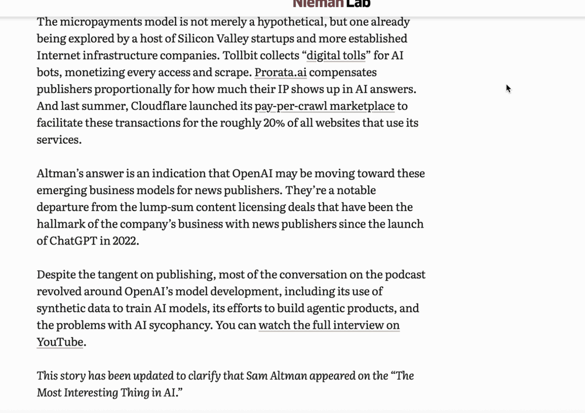
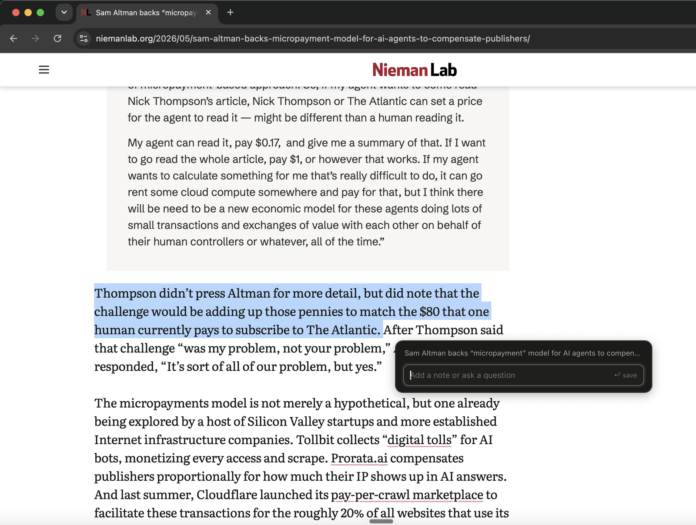
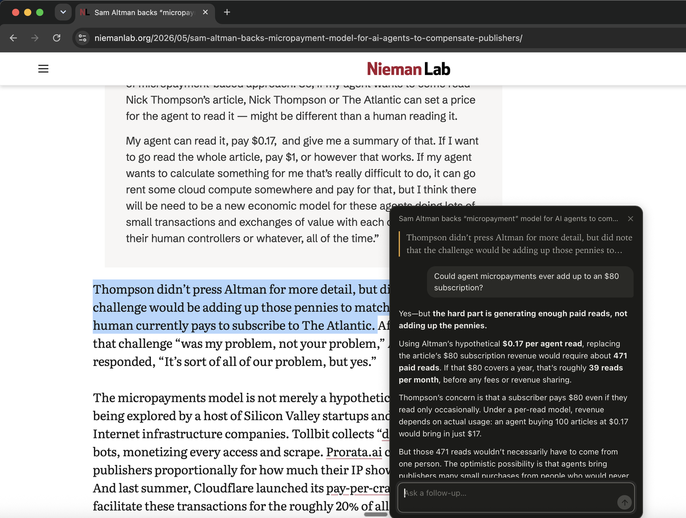
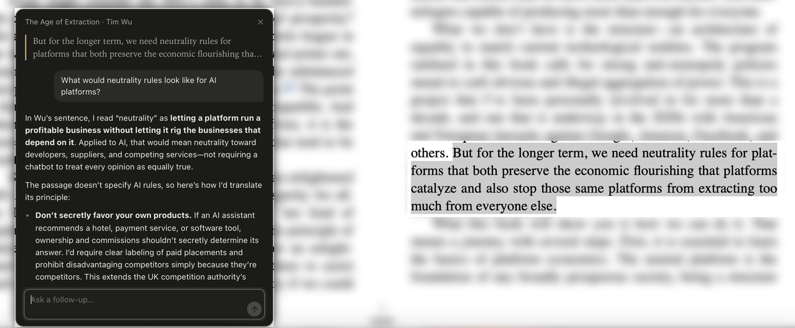
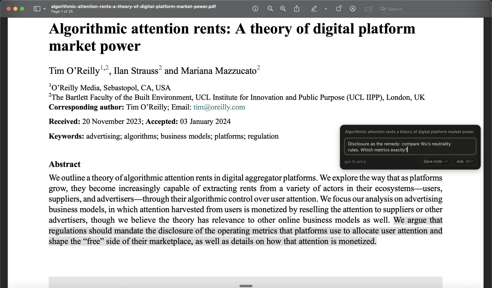

# Margin

**Ask questions and take notes on anything you read, and grow a digital garden along the way.**

Select a passage in Chrome, Apple Books, Preview or almost any Mac app and press **⌃⌥M**. A small card opens beside it. Ask a question and get an answer that already knows what you're reading, or jot a note and get back to the page.

Everything you keep lands in plain Markdown, one file per book or article: the passage, your note, the conversation. Read for a few months and those files add up to a garden of what you've read and what you thought about it, ready to search, link and grow in Obsidian.



- **Ask without leaving the page.** The model sees the passage, the text around it and where it's from, and can search the web. No copying into a chat window, no losing your place.
- **Works where you read.** Browsers, Apple Books, PDFs, Notes: if you can select it, Margin can keep it.
- **Your garden grows itself.** Each book or article becomes a Markdown file of its highlights, notes and answers, with properties Obsidian and Dataview can query. Point it at your vault and link your own notes to it.
- **Find it again.** `npm run search -- platforms` searches every passage, note and answer you've kept.
- **Local first.** Your notes are files on your disk, with no account or cloud. Nothing leaves your Mac until you ask a question, and [here's exactly what's sent](#what-the-model-sees-when-you-ask) when you do.

---

## What you need

- macOS 14 or later
- [Node.js](https://nodejs.org) 20 or later (`node -v`)
- Xcode Command Line Tools, for `swiftc` (`xcode-select --install`)
- An OpenAI API key **or** a ChatGPT Plus/Pro plan. Notes work without either.

Margin has no npm dependencies, so there's no `npm install` step.

## Setup

Setup takes about five minutes.

### 1. Get the code

```sh
git clone https://github.com/szaryw/margin.git
cd margin
cp .env.example .env
```

### 2. Connect a model (pick one)

**Option A: an OpenAI API key.** Put it in `.env`:

```sh
OPENAI_API_KEY=sk-...
```

**Option B: your ChatGPT plan.** Leave the key empty and sign in once:

```sh
npm run login
```

Your browser opens ChatGPT's consent page. Sign in and allow Margin to use your plan. The terminal then confirms it:

```
Opening ChatGPT in your browser. Sign in and allow Margin to use your plan.

Signed in as you@example.com. Margin will use your ChatGPT plan.
```

The sign-in is saved in `.auth/chatgpt.json`, which is git-ignored and readable only by you. `npm run logout` signs out.

If both are set, the API key is used.

### 3. Build and open the app

```sh
sh app/build.sh
open app/build/Margin.app
```

An **M** appears in the menu bar. macOS asks for **Accessibility** access, which Margin needs to read what you've selected. Turn it on in **System Settings ▸ Privacy & Security ▸ Accessibility**, then quit Margin from its menu and open it again.

The app starts Margin's local server for you, using this folder and your `.env`. Server output goes to `~/Library/Logs/Margin.log`.

> **Rebuilding?** macOS links the Accessibility permission to the app's signature. Ad-hoc builds lose it on every rebuild. For a signature that stays the same between builds, create a self-signed certificate once: open Keychain Access, choose **Certificate Assistant ▸ Create a Certificate…**, name it `Margin Local Signing`, and set Identity Type to *Self Signed Root* and Certificate Type to *Code Signing*. `build.sh` uses it automatically.

To start Margin when you log in, add `Margin.app` in **System Settings ▸ General ▸ Login Items**.

## Using it

### Select, then ⌃⌥M

Select some text and press **⌃⌥M**. The card opens next to your selection and already knows where the text is from. Nothing is saved until you say so:

| You press | What happens |
|---|---|
| **↩** on the empty box | Saves just the highlight |
| Type a note, **↩** | Saves the highlight with your note |
| Type a question, **⌘↩** | Saves it and asks the model; the card becomes a conversation |
| **Esc**, or click back into the page | Closes the card and discards the highlight |

### Walkthrough

Every screenshot here is real: real selections, real typed questions, live answers.

**1. A news story.** You're reading a [Nieman Lab piece](https://www.niemanlab.org/2026/05/sam-altman-backs-micropayment-model-for-ai-agents-to-compensate-publishers/) about AI agents paying publishers per read, and you wonder whether those pennies could ever add up. Select the sentence and press ⌃⌥M:



Ask *"Could agent micropayments ever add up to an $80 subscription?"* with ⌘↩, and the card turns into a conversation:



The answer works from the article's own numbers, because Margin sent the page around the passage along with your question ([what gets sent](#what-the-model-sees-when-you-ask)). Sources it looked up appear as links underneath.

**2. A book.** In Tim Wu's *The Age of Extraction* in Apple Books, a line about "neutrality rules for platforms" begs the obvious next question: *"What would neutrality rules look like for AI platforms?"* Margin already knows the book and its author, so you don't have to explain where the quote came from. Keep the conversation going with follow-ups in the same card. (The book's page is blurred in the screenshot, apart from the passage.)



**3. A PDF.** Not every thought needs an answer. Reading O'Reilly, Strauss & Mazzucato's paper [*Algorithmic attention rents*](https://doi.org/10.1017/dap.2024.1) in Preview, select the sentence on disclosure, type a quick note linking it back to Wu, and press **↩**. Saved, and you're back to reading.



### From highlights to a garden

Margin keeps your *literature notes*: what each source said, and what you asked about it in the moment. Your garden grows on top of them.

Every book or article gets one Markdown file in `~/Documents/Margin` (or `MARGIN_DIR`), collecting its highlights, notes and conversations, oldest first, under properties describing the source:

```markdown
---
title: "Algorithmic attention rents a theory of digital platform market power"
type: "pdf"
path: "/Users/you/Downloads/algorithmic-attention-rents-a-theory-of-digital-platform-market-power.pdf"
app: "Preview"
highlights: 2
first_highlight: 2026-10-05
last_highlight: 2026-10-05
---

# Algorithmic attention rents a theory of digital platform market power

## 5 Oct 2026, 20:44

> We argue that regulations should mandate the disclosure of the operating metrics that platforms use to allocate user attention and shape the "free" side of their marketplace, as well as details on how that attention is monetized.

*Note:* Disclosure as the remedy: compare Wu's neutrality rules. Which metrics exactly?
```

**Search everything you've read.** `npm run search` looks through every passage, note, question and answer, across all your sources, and lists the best matches first. Here one word connects a passage in a book with two highlights on a paper:

```
$ npm run search -- platforms

The Age of Extraction · Tim Wu  (5 Oct 2026)
  > But for the longer term, we need neutrality rules for platforms that both preserve the economic flourishing…
  Q: What would neutrality rules look like for AI platforms?
  ~/Documents/Margin/The Age of Extraction.md

Algorithmic attention rents a theory of digital platform market power  (5 Oct 2026)
  > We argue that regulations should mandate the disclosure of the operating metrics that platforms use…
  Note: Disclosure as the remedy: compare Wu's neutrality rules. Which metrics exactly?
  ~/Documents/Margin/Algorithmic attention rents a theory of digital platform market power.md

3 highlights match "platforms".
```

Add `--json` to get the full matches (passages, notes and whole conversations) for scripts or other tools.

**Open it in Obsidian.** Set `MARGIN_DIR` to a folder inside your vault (here, one called `Margin`) and every book and article you've read shows up as a note, with its properties shown at the top. With the Dataview plugin, you can list them like any other notes:

````markdown
```dataview
TABLE author, highlights, last_highlight AS "last read"
FROM "Margin"
SORT last_highlight DESC
```
````

**Link your own thinking to it.** Write your *permanent notes* in your own files and link to sources with `[[The Age of Extraction]]`. Over time, a book you highlighted in March and a paper you read in September end up a link apart. Keep your writing out of Margin's files, though: Margin rewrites a source's file each time you add a highlight to it.

### What's saved when you capture

Pressing ⌃⌥M doesn't write anything yet. The highlight waits in memory until you keep it (a note, a question, or ↩), and **Esc** throws it away without a trace. Once you keep it, Margin writes two things to your notes folder, and nothing anywhere else:

- **The Markdown file** for that book or article: the passage, your note, any conversation, when you captured it, and where it came from (title and author, the URL, or for a PDF its file name and location on your Mac).
- **A JSON copy** in a hidden `.margin/` subfolder, which Margin reads when it starts. It holds the same details, plus the text around the passage that goes with your questions (up to about 6,000 characters of a web page) and which model answered.

Margin never saves screenshots, whole pages or documents, or anything from your clipboard. You can edit or move the Markdown files, but Margin rewrites a source's file whenever you add to that source.

Choose **Show Highlights in Finder** from the menu-bar **M** to open the folder.

## Where it reads text from

| App | How the selection is read | Source shown as |
|---|---|---|
| Safari, Chrome, Arc, Brave, Edge | Accessibility (no clipboard) | Page title + URL |
| Apple Books | Books' own Copy, after which your clipboard is put back | Book title + author |
| Preview and other PDF apps | Accessibility, or the app's Copy | File name, tidied |
| Notes, TextEdit, most other apps | Accessibility, or the app's Copy | Window title |

## Settings

Set these in `.env`. Restart Margin after changing them.

| Setting | Default | |
|---|---|---|
| `OPENAI_API_KEY` | empty | Use an API key instead of the ChatGPT sign-in |
| `MARGIN_MODEL` | first model your plan lists, or `gpt-5.5` with a key | Which model answers |
| `MARGIN_WEB_SEARCH` | `on` | Let answers search the web |
| `MARGIN_DIR` | `~/Documents/Margin` | Where the Markdown notes go |

## What the model sees when you ask

Nothing leaves your Mac when you save a highlight or a note. When you ask a question, Margin sends OpenAI:

- **The passage you selected**, tidied up (stray line breaks and hyphens from PDFs removed).
- **Where it's from:** the kind of source, its title, the author for books, the URL for web pages, and the app's name. For a PDF, only the tidied file name is sent, never the path on your Mac.
- **Your note**, if you wrote one.
- **The conversation so far** in that card, so follow-ups make sense.
- **Text around the passage**, when the app makes it available:

| Reading in | Text around the passage |
|---|---|
| Safari, Chrome, Arc, Brave, Edge | About 6,000 characters of the page around your selection, read from the page your browser has open (pages you're logged into included) |
| Notes, TextEdit and other apps that expose their text | Up to about 800 characters either side of the selection |
| Apple Books, Preview and most PDF apps | None: just the passage, plus the title and author or the file name |

The model can also search the web when your question goes beyond the source (turn this off with `MARGIN_WEB_SEARCH=off`). It decides what to search for, and the pages it used show as links under the answer.

Nothing else is sent: no screenshots, other tabs, clipboard contents, the rest of the book or document, or your other highlights. Each question is sent with `store: false`, so OpenAI doesn't save the response for later retrieval, and the conversation won't appear in your ChatGPT history.

## Privacy

- The server only listens on `127.0.0.1:4319`. It rejects requests from other sites and other host names.
- Nothing leaves your Mac until you ask a question; [what the model sees](#what-the-model-sees-when-you-ask) lists exactly what's sent then.
- Notes stay in your folder ([what's saved](#whats-saved-when-you-capture)). Margin has no account, sync or analytics of its own.
- Your ChatGPT sign-in is kept in `.auth/chatgpt.json` in the Margin folder, readable only by your user account and never committed to git. `npm run logout` deletes it and asks OpenAI to revoke it.

## Troubleshooting

- **`build.sh` fails with "redefinition of module 'SwiftBridging'"** (usually followed by "this SDK is not supported by the compiler"): some Xcode Command Line Tools versions ship two files that define the same module, and no Swift app will build until one is moved aside. Reinstalling the same version doesn't help. Run `sudo mv /Library/Developer/CommandLineTools/usr/include/swift/module.modulemap ~/module.modulemap.bak` and build again. If it still fails, install the latest Command Line Tools: run `softwareupdate --list`, then `softwareupdate --install` with the "Command Line Tools" label it shows. With Xcode installed, `sudo xcode-select -s /Applications/Xcode.app/Contents/Developer` also works.
- **"Margin needs Accessibility access"**: turn it on as described in step 3, then quit and reopen Margin. If it's already on but still fails after a rebuild, remove Margin from the list, add it again, and see the signing note above.
- **"⌃⌥M is taken"**: another app has the shortcut. Quit that app and reopen Margin.
- **"Margin's server isn't running"**: open **Open Server Log** from the menu-bar **M**. Running `npm start` in a terminal shows the same output. When a server is already running, the app uses it instead of starting its own.
- **"Margin isn't connected to a model"**: add `OPENAI_API_KEY` to `.env` or run `npm run login`, then restart Margin. Saving notes still works.
- **Nothing happens in Books**: make sure some text is actually selected. Books lets Margin copy only a selection.

## How it works

```
app/       Swift menu-bar app: hotkey, reading the selection, the floating card window
server/    Node server with no npm dependencies: saves highlights, calls the model, serves the card
  search.js  npm run search: finds highlights across every source
  card/    The card itself (plain HTML, CSS and JS) shown in the app's window
```

1. On ⌃⌥M, the app reads the selection from the app in front through Accessibility. Where that doesn't work (Books, some PDF apps), it presses the app's own **Edit ▸ Copy** and then puts your clipboard back. For browsers it also reads the page's URL, title and text.
2. The app sends this to the server, which keeps a *pending* highlight in memory. The card then appears beside the pointer, in a window that never takes focus away from what you're reading.
3. A note, a question or ↩ keeps the highlight, and it's written to disk. Questions stream from OpenAI's Responses API.

To trigger a capture from Shortcuts, Raycast or a script instead of the hotkey:

```sh
osascript -l JavaScript -e '$.NSDistributedNotificationCenter.defaultCenter.postNotificationNameObjectUserInfoDeliverImmediately("dev.margin.capture", $(), $(), true)'
```

Run the server's tests with `npm test`.

## License

MIT
